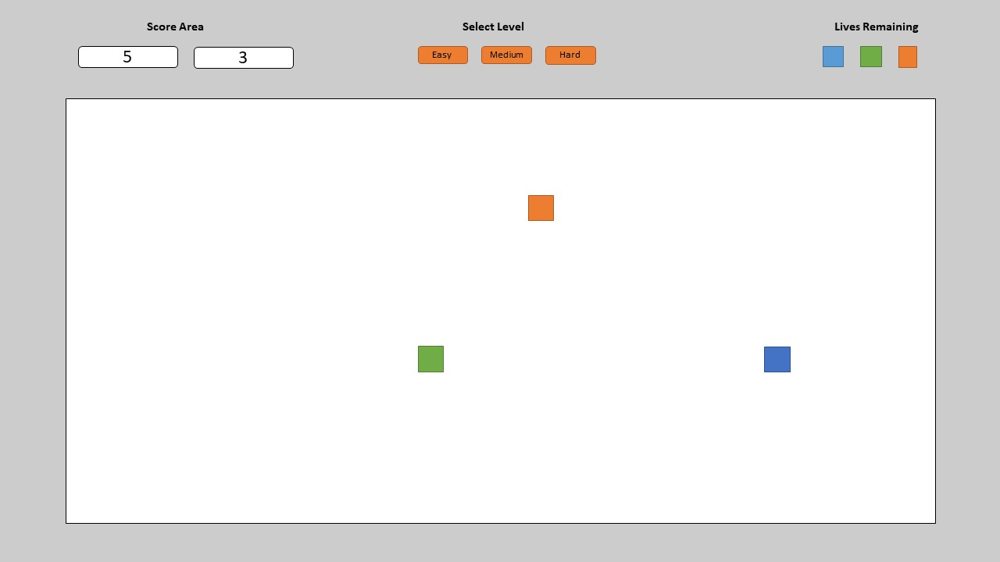
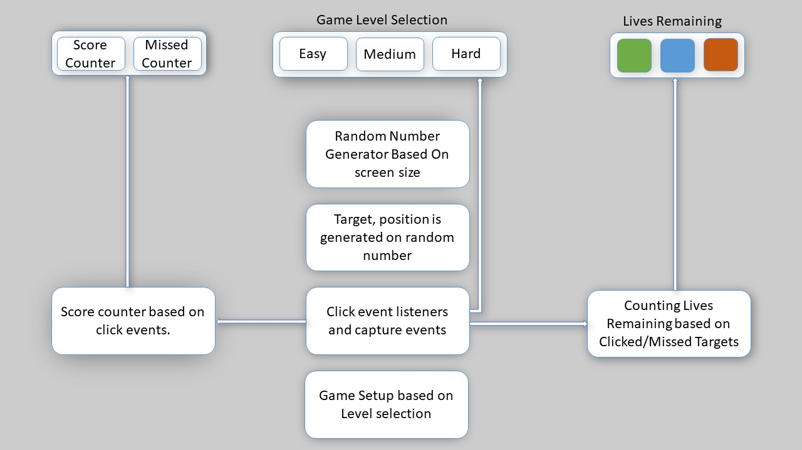
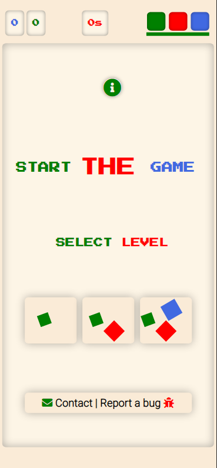
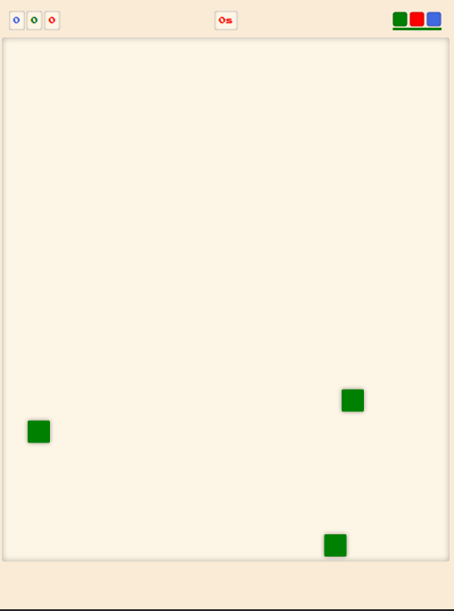
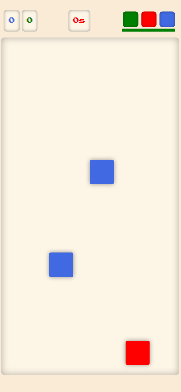
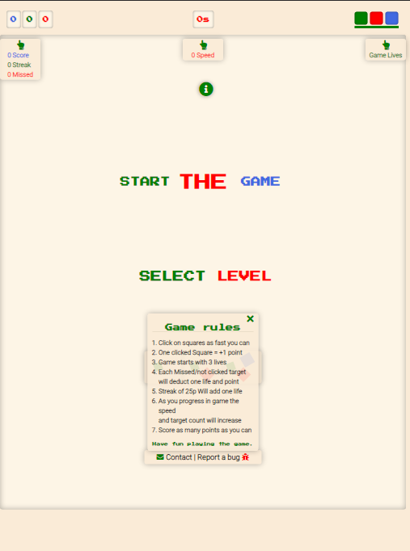
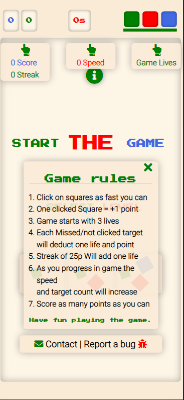
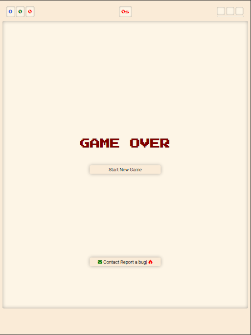
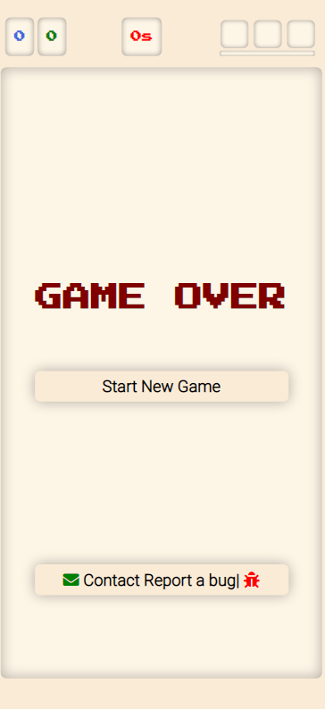

# Top

## MS-2 JavaScript | Reaction Time Game.

<!--For assestment - README.md file structure was copied from my first milestone project."-->

## [View the live project here.](https://raivis80.github.io/MS-2-JavaScript/game.html)
### Table of contents

1. [Introduction](#Introduction)
1. [Design](#Design)
    - [External User's goal's](#External-User's-goal's)
    - [Site owner's goal's](#Site-owner's-goal's)
    - [Functionality Requirements](#Functionality-Requirements)
    - [Wireframes](#Wireframes)
    - [Game design](#Game-design)
1. [Features](#Features)
1. [Testing](#Testing)
1. [Technologies and Frameworks](#Technologies-and-Frameworks)
   - [Markup/Scripting/Programming languages](#Markup/Scripting/Programming-languages)
   - [Frameworks/Libraries/Programs](#Frameworks/Libraries/Programs)  
1. [Deployment](#Deployment)
   - [Deployment on GitHub Pages](#Deploying-on-GitHub-Pages)
   - [Forking the Repository](#Forking-the-Repository)
   - [Creating a Clone](#Creating-a-Clone)
1. [Credits](#Credits)
   - [Helpfull sites](#Helpfull-sites)
   - [Images](#Images)
   - [Acknowledgements](#Acknowledgements)

# [&#8686;](#Top)
## ***Introduction***

**Single-player reaction time game** 

This is my second of four Milestone Projects that the developer must complete during Full Stack Web Development Program at The Code Institute. 

The main requirements is to write custom front-end interactive web application, using HTML, CSS and Javascript, JavaScript libraries and/or Application Programming Interfaces (APIs).

In order to manipulate the DOM as much as posible, I'm building a simple JavaScript single-player reaction time game.  
The objective of the game is to click or tap the objects that are spawning randomly on the screen as quickly as you can. 
To keep the game challenging, complexity will increase over the course of the game.
# [&#8686;](#Top)

## **Design**
### **External User's goal's**
1. Have fun playing game.
### **Site owner's goal's**
1. Make a game that is fun to play
### **Functionality Requirements**
1. Build a simple single-player reaction time game.
1. Increase in complexity over the course of the game.
1. Click counter if player clicks or misses the target.
1. Provide player with instructions on how to play the game.
1. Integrate feedback form if encountered bugs or glitches.
1. Provide player with feedback on how they're doing at any stage.

### **Game Mechanics**
1. Game Play
    - Select dificulty level to start the game.
    - Click or tap on target objects once they spawn.
1. Select Level 
    - Select Dificulty level "Easy", "Medium", "Hard".
        - "Easy" Start with one target.
        - "Medium" Start with two targets.
        - "Hard" Start with three targets. 
1. Score Counters
    - Score counter:
        - Will increase by 1, once player clicks the target.
    - Missed score counter:
        - Will increase by 1 if target is not clicked on time or target is missed altogether.
1. Lives Remaining
    - The game starts with three lives.
    - Players will gain life once every {??} score points. 
    - Maximum three lives can be gained at once.
    - Player will lose life if target is not clicked on time or target is missed altogether. 
    - Losing all lives means "game over".
# [&#8686;](#Top)
### **Wireframes**

# [&#8686;](#Top)

# [&#8686;](#Top)
### **Game design**
- Select Level
    - Levels = "Easy" Start with one target, "Medium" start with two targets "Hard" start with three targets.
    - For level sellection buttons I'm targeting HTML 'p' enements and I have attached click event listener for each game level function.
- Lives Remaining
    - Based on capture and click events, all Unsuccessful clicks and missed on time events will disable one life element (if statement)
    - Based on Score counter, every 10 score points will create one life. Enable one life element (if statement).
    or miss click the box on time 
- Random Number generator
    - Extract Window height and width.
    - Create random number integer generator
    - Generate two integers based on screen height and width.
- In game target objects
    - Target HTML div elements in the DOM for game box targets.
    - Two random generated integers used for position x and y coardinates to target css position properties for HTML div elements.
- Click event listeners and capture events.
    - Create event listeners for game targets that will record successfull clicks.
    - Create event listener for game window to record unsuccessful clicks.
    - Capture events on all failed on time click attempts.
- Game setup
    - Basedd on Level selection. if "EASY", else if "MEDIUM", else if "HARD".
    - Level variable will be passed into setInterval() function within the gameSetup() function and will launch the game.
- Game Proggression levels
    - Speed will increase over course of the game. 
    - Target count will increase  over course of the game
    - Create setInterval() function pass it into game level sellection once store reached.

# [&#8686;](#Top)
## **Features**

- The game 
    -  Is responsive works on most devices(deskpop, mobile)
    -  It can be resized and it will recalculate the game area on the fly.
- Game Window
    -  Interactive game area, that is where target box objects spawn for user to click or tap on.
- Select Level
    - Player can select difficulty level.
- Score counter 
    - Enables players to keep track of points when playing a game.
- Speed display
    -  Enables players see current game speed in secounds.
- Lives Remaining
    - If you miss box target, you lose one life but once score 10 has been reached, you will gain one life.
- Game-level-Up
    - Gain enough points in the game to enable a player to go up to a higher level.
    - Speed and target count is increasing over course of the game.
- Contact/Bug report form
    - For users to be able to send feedback or contact if they incounter any gliches or bugs.
- Game Help/instruction Popout
    - Enables Player to to looak at game instructions on how to play the game.

### **Home Page**

### **In Game**

### **Game Information Popout**

### **Game Over**

### **Contact | Bug report**

# [&#8686;](#Top)
## **TESTING**
The Game was tested on Chrome, Opera, Microsoft edge and Firefox desktop version browsers and on huawei p30 Pro chrome and android browser.
Chrome DevTools was used to Test variety of devices such as Desktop, Laptop, iPhone7, iPhone 8 & iPhoneX for responsive design.

# [&#8686;](#Top)
## **Technologies and Frameworks**
### **Markup/Scripting/Programming languages**
- [HTML5](https://en.wikipedia.org/wiki/HTML5) Hypertext Markup Language (HTML)
- [CSS3](https://en.wikipedia.org/wiki/Cascading_Style_Sheets) Cascading Style Sheets (CSS)
- [JavaScript](https://www.javascript.com/) Interactive functionality.

### **Frameworks/Libraries/Programs**
- [Google Fonts:](https://fonts.google.com/) Making the web more beautiful.
- [Font Awesome:](https://fontawesome.com/) to add icons to the website.
- [jQuery:](https://jquery.com/) used for interactive functionality.
- [Git](https://git-scm.com/) Git was used for version control.
- [GitHub:](https://github.com/) used to store the projects code.
- [gitpod.io](https://gitpod.io/) gitpod Was used for codding.
- [VS Code](https://code.visualstudio.com/) gitpod Was used for codding.
- [Balsamiq:](https://balsamiq.com/) was used to create the wireframes.

# [&#8686;](#Top)
## ***Deployment***
Source: https://docs.github.com/
### **Deploying on GitHub Pages**
1. Log into [GitHub](https://github.com/login "Link to GitHub login page") or [create an account](https://github.com/join "Link to GitHub create account page").
1. Locate the [GitHub Repository](https://github.com/Raivis80/)"Link to GitHub Repo".
1. In the GitHub repository, navigate to the Settings tab.
1. From the source section drop-down menu, select the Master Branch.
1. Upon selection, the page will automatically refresh meaning that the website is now deployed.
1. Under "GitHub Pages", select the GitHub Pages visibility drop-down menu, then click a visibility.
1. Now deploy it to GitHub Pages.
1. To see your published site, under "GitHub Pages", click your site's URL.

More Detailed information on GitHub Pages can be found here: [here](https://docs.github.com/en/pages/getting-started-with-github-pages/creating-a-github-pages-site#creating-your-site) "Link to GitHub docs"
### **Fork A repository**
A Fork is a coppy of repository allows you to freely experiment with changes without effecting the original project.
 Forking a repository is a simple two-step process.

1. On GitHub, navigate to The [GitHub Repository](https://github.com/Raivis80/)" Link to my Repo".
1. In the top-right corner of the page, click Fork.

Detailed Steps for forkig a repository from GitHub can be found here: [here](https://docs.github.com/en/get-started/quickstart/fork-a-repo)
### **Creating a Clone**
You can clone reposetory. When you clone repository, you copy repository to your Machine.
 Locate the [GitHub Repository](https://github.com/Raivis80/)"Link to GitHub Repo".
 Steps for cloning a repository from GitHub can be found here: [here](https://docs.github.com/en/free-pro-team@latest/github/creating-cloning-and-archiving-repositories/cloning-a-repository) "Link to GitHub docs"
# [&#8686;](#Top)
## ***Credits***
### **Helpfull sites**
-  [google.com](https://google.com/): Search for anything if stuck.
-  [stackoverflow.com](https://stackoverflow.com/): Useful website for code tips.
-  [www.w3schools](https://www.w3schools.com/): Examples of how to use HTML, CSS, JavaScript.
-  [developer.mozilla.org](https://developer.mozilla.org/): Examples of how to use HTML, CSS, JavaScript.
-  [css-tricks.com](https://css-tricks.com/): Useful CSS styling tips.

### **Images** 
### **Acknowledgements**
- A huge thanks to Owonikoko Oluwaseun, My Mentor for continuous support and inspire me to push myself beyond where I think I can go.
- Tutor support at Code Institute for their support.

# [&#8686;](#Top)